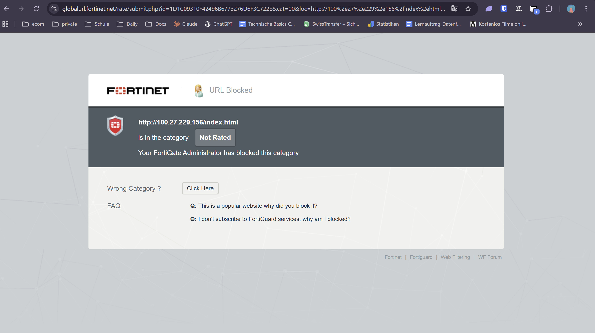
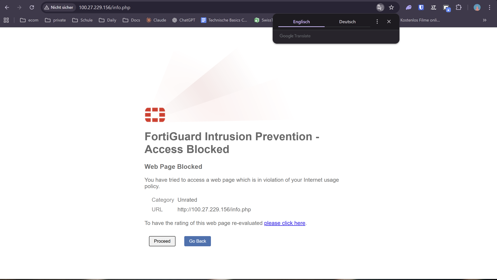
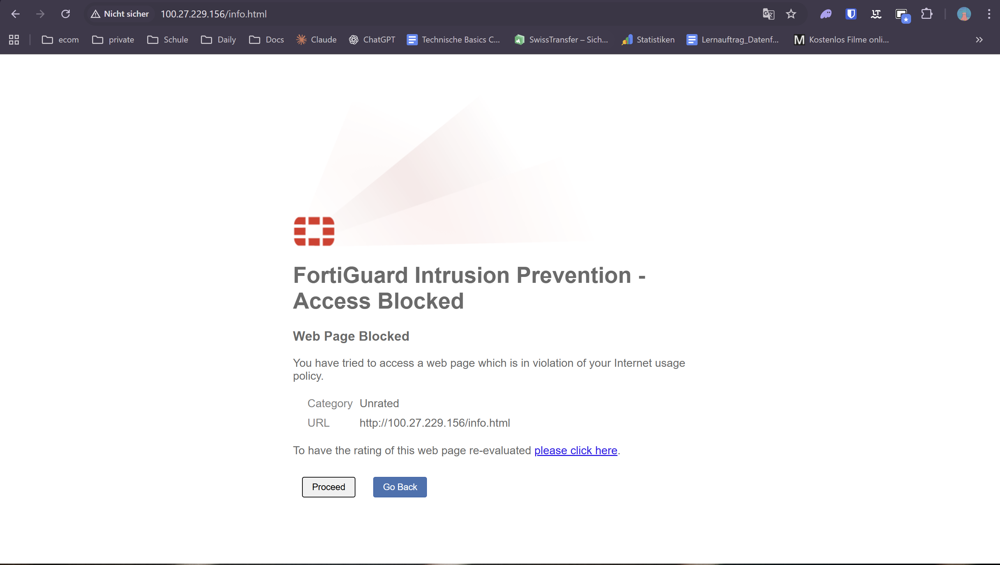
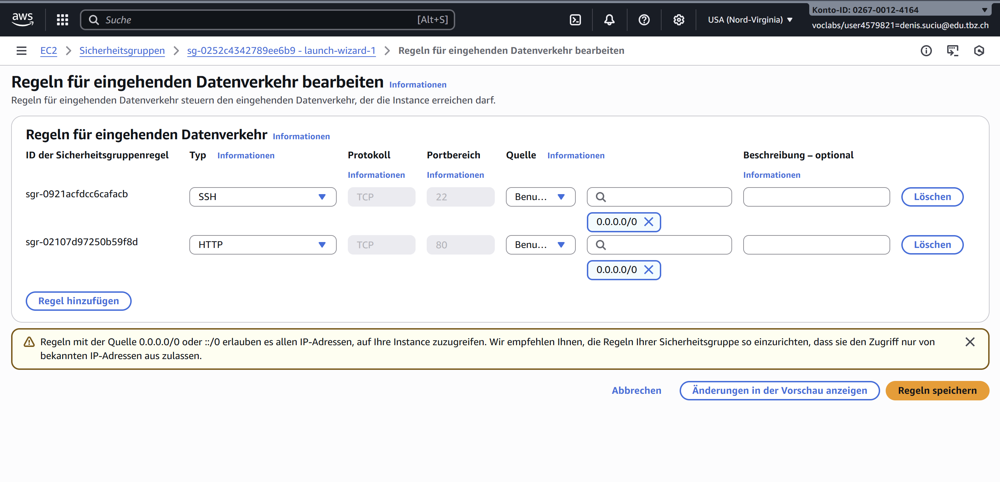
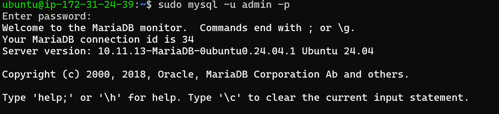

## KN03 – Installation von Web- und Datenbankserver

Dieser Bericht beschreibt die auf Ubuntu umgesetzten Schritte zur Installation und Inbetriebnahme von Apache, PHP und MariaDB inkl. Tests der bereitgestellten PHP-Seiten und Anpassung der AWS-Sicherheitsgruppe.

---

### 1. Vorbereitung und Paketinstallation

1. `sudo apt update`  
   Aktualisiert die Paketlisten, damit alle nachfolgenden Installationen die neuesten Versionen verwenden.
2. `sudo apt install apache2`  
   Installiert den Apache Webserver inklusive Systemd-Service (`apache2.service`).
3. `sudo apt install php`  
   Bringt den PHP-Interpreter samt Standardmodulen auf das System.
4. `sudo apt install libapache2-mod-php`  
   Lädt das Apache-Modul, welches PHP-Skripte direkt im Webserver ausführt (Handler).
5. `sudo apt install mariadb-server`  
   Installiert den MariaDB-Datenbankserver inklusive `mariadb.service`.
6. `sudo apt install php-mysql`  
   Fügt das PHP-MySQL(i) Modul hinzu, damit PHP-Skripte MariaDB abfragen können.

Zusätzliche Maßnahmen:

- `sudo mysql -sfu root -e "GRANT ALL ON *.* TO 'admin'@'%' IDENTIFIED BY '<einzigartiges-passwort>' WITH GRANT OPTION;"`  
  Legt den Benutzer `admin` für externe Verbindungen an. `<einzigartiges-passwort>` wurde durch ein individuelles Passwort ersetzt.
- `sudo systemctl restart mariadb.service` und `sudo systemctl restart apache2`  
  Starten beide Services neu, so dass neue Konfigurationen aktiv sind.
- `cd ~ && git clone https://gitlab.com/ch-tbz-it/Stud/m346/m346scripts.git`  
  Klont das Skript-Repository.

### 2. Anpassung der PHP-Dateien

Im Verzeichnis `~/m346scripts/KN03/` wurden die Dateien `info.php` und `db.php` geprüft. Damit `db.php` fehlerfrei funktioniert, musste der MariaDB-Login (`$servername`, `$username`, `$password`) auf den neu erstellten Benutzer `admin` angepasst werden, inkl. des individuellen Passworts. Anschließend:

```
sudo cp ~/m346scripts/KN03/*.php /var/www/html/
```

### 3. Sicherheitsgruppe konfigurieren

In AWS wurde die zur Instanz gehörende Sicherheitsgruppe ermittelt. Anpassungen:

- Eingehende Regeln: Port 80 (HTTP) und Port 22 (SSH) auf `0.0.0.0/0` erlaubt.  
- Ausgehende Regeln unverändert gelassen (Standard „alle ausgehend“).

Dadurch sind Webserverzugriff und SSH möglich.

### 4. Funktionstests

- `http://<öffentliche-IP>/index.html` → Standard-Apache-Seite sichtbar.  
- `http://<öffentliche-IP>/info.php` → PHP-Info wird angezeigt.  
- `http://<öffentliche-IP>/db.php` → Ausgabe der MariaDB-Benutzer inkl. `admin`.

### 5. MariaDB-Selekt und Erklärung

Login:

```
mysql -u admin -p -h localhost
```

Abfrage (identisch zu `db.php`):

```sql
SELECT user, host FROM mysql.user;
```

Erklärung: Das Statement listet alle in der internen Tabelle `mysql.user` hinterlegten Accounts mit zugehörigen Hosts auf. So lässt sich prüfen, ob der Benutzer `admin` korrekt angelegt wurde und von `%` zugreifen darf.

Auszug aus der Konsole:

```
ubuntu@ip-172-31-24-39:~$ mysql -u admin -p
Welcome to the MariaDB monitor.  Commands end with ; or \g.
Server version: 10.11.13-MariaDB-0ubuntu0.24.04.1 Ubuntu 24.04

MariaDB [(none)]> select Host, User from mysql.user;
+-----------+-------------+
| Host      | User        |
+-----------+-------------+
| %         | admin       |
| localhost | mariadb.sys |
| localhost | mysql       |
| localhost | root        |
+-----------+-------------+
4 rows in set (0.002 sec)
```

### 6. Leitfragen / Checkpoints

- Bedeutung von `sudo`: Befehle werden mit Root-Rechten ausgeführt, notwendig für System-/Paketänderungen.
- Paketinstallation via `apt`: `apt install <paket>` installiert Software inkl. Abhängigkeiten, `apt update` aktualisiert die Paketlisten.
- Apache/PHP/MariaDB:  
  - `apache2` stellt HTTP-Dienste bereit.  
  - `php` liefert den Interpreter für serverseitige Scripts.  
  - `mariadb-server` stellt den relationalen Datenbankdienst.  
- Zusätzliche Module:  
  - `libapache2-mod-php` bindet PHP als Apache-Modul ein.  
  - `php-mysql` liefert den PHP-Treiber zur Kommunikation mit MariaDB/MySQL.  
- Sicherheitsgruppen: Regeln steuern eingehende Ports; Port 80 für HTTP, Port 22 für SSH mussten explizit freigegeben werden.
- Ports: Identifizieren logische Kommunikationsendpunkte; nur freigegebene Ports sind extern erreichbar.
- `mysql` Konsole: Mit `mysql -u <user> -p` lässt sich interaktiv anmelden und SQL ausführen.
- `systemctl`: Verwaltung von Services (`start`, `stop`, `restart`, `status`), z. B. `sudo systemctl status apache2`.
- `cp`: Kopiert Dateien (`sudo cp src dest`), z. B. PHP-Files nach `/var/www/html/`.

### 7. Screenshots

- Apache `index.html`:  
  
- PHP Info (`info.php`):  
  
- Datenbank-Test (`db.php`):  
  - Datenbank-Test mit Resultat:  
    
- Instanzdetails mit öffentlicher IP:  
  
- Sicherheitsgruppe (Ports 22 & 80 offen):  
  
- MySQL-Login als `admin` inkl. Abfrage:  
  
