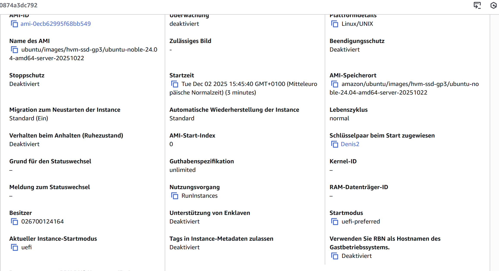
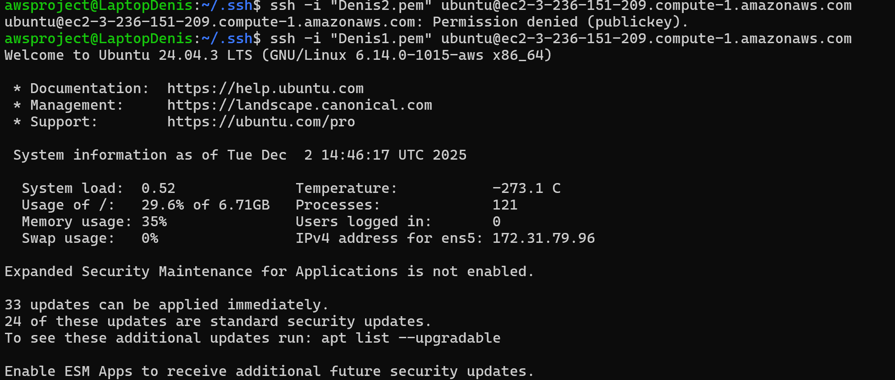
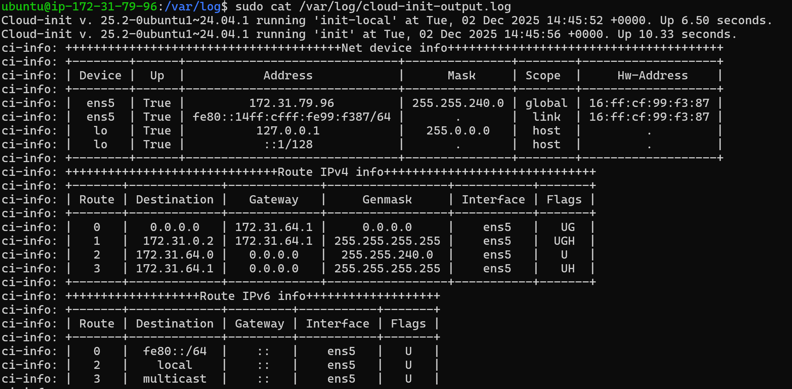
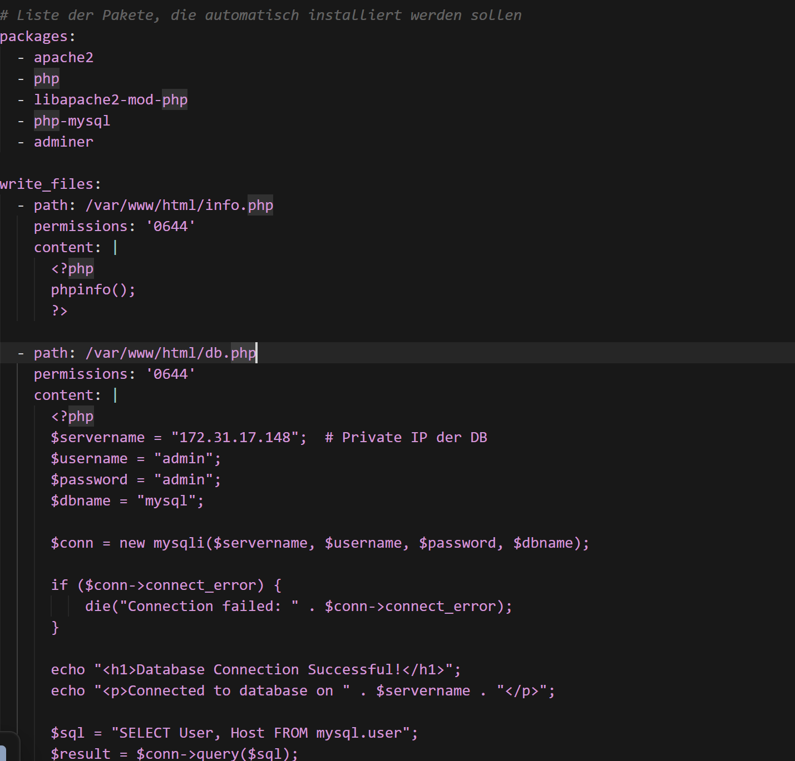
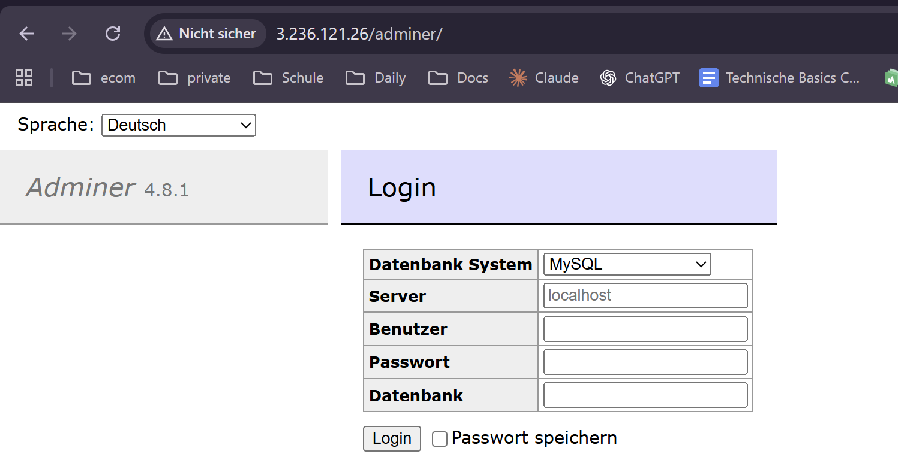
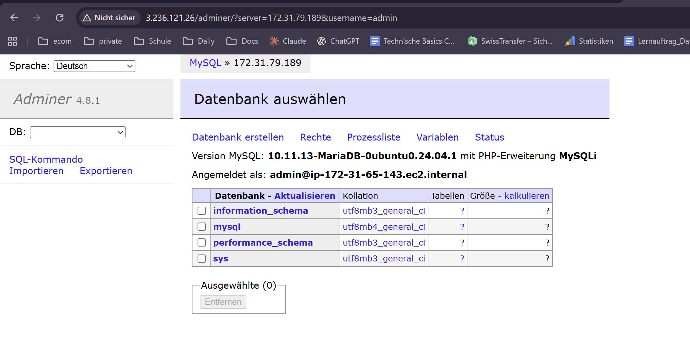
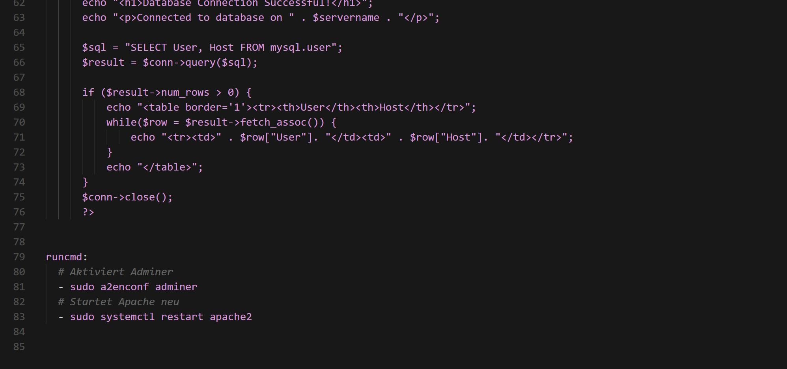

## KN04 – Cloud-init & SSH-Key

### A) Cloud-init Datei verstehen (10 %)

- **Ziel**: Verständnis von Cloud-init und dem YAML-Format.
- **Aufgabe**:
  - Theorie zu **Cloud-init** und **YAML** lesen.
  - Vorgegebene `cloud-init.yaml` herunterladen.
  - **Alle Zeilen** der Cloud-init Datei im Schema `Konfiguration # Erklärung` dokumentieren, z.B.:
    - `#cloud-config  # Deklariert die Datei als Cloud-Init-Konfiguration`
    - `users:  # Definition der Benutzer, die bei der Initialisierung erstellt/konfiguriert werden`
    - `- name: ubuntu  # Benutzername`
    - `sudo: ALL=(ALL) NOPASSWD:ALL  # sudo-Regeln für diesen Benutzer`

- **Umsetzung in diesem Projekt**:
  - Die Datei `cloud-init.yaml` wurde vollständig kommentiert, sodass jede Zeile bzw. jeder Block mit einer kurzen Erklärung versehen ist.

- **Abgabe A**:
  - **Dokumentierte YAML-Datei**: `cloud-init.yaml` (mit Kommentaren) im Git-Repository.

---

### B) SSH-Key und Cloud-init (15 %)

- **Ziel**: Verständnis von SSH mit Private/Public Key und Verwendung von SSH-Keys über Cloud-init und AWS-GUI.

- **Schritte**:
  1. **Public Keys aus privaten Schlüsseln extrahieren** (aus KN02):
     - Erster Key (für Cloud-init):
       - Per Befehl z.B.: `ssh-keygen -y -f key1 > key1.pub`
     - Zweiter Key (für AWS-GUI):
       - Per Befehl z.B.: `ssh-keygen -y -f key2 > key2.pub`
  2. **Neue Instanz in AWS erstellen**:
     - AMI: **Ubuntu 24.04**
     - **Key pair**: zweiten Schlüssel (`key2`) auswählen.
     - Sonstige Einstellungen: Standard, ausser Cloud-init/User Data.
  3. **Cloud-init mit erstem Public Key anpassen**:
     - In `cloud-init.yaml` unter `ssh_authorized_keys` den Eintrag ersetzen durch den Inhalt von `key1.pub` im Format:
       - `ssh-rsa <ihr-Schlüssel-ohne-zeilenumbrüche> aws-key`
     - Die komplette `cloud-init.yaml` in AWS im Bereich **Advanced details → User data** einfügen.
  4. **SSH-Login testen**:
     - Mit **erstem privaten Key** (zu `key1.pub` / Cloud-init):
       - `ssh -i key1 ubuntu@<public-ip>`
     - Mit **zweitem privaten Key** (zu `key2.pub` / AWS-GUI):
       - `ssh -i key2 ubuntu@<public-ip>`
     - Nachweis, dass der Login mit dem ersten Key aus der Cloud-init-Konfiguration funktioniert.
  5. **Cloud-init-Log einsehen**:
     - Befehl auf der Instanz:
       - `sudo cat /var/log/cloud-init-output.log`
     - Pfad für spätere Fehleranalysen merken: `/var/log/cloud-init-output.log`

- **Abgaben B**:
  - **Angepasste Cloud-init Konfiguration**:
    - Datei `cloud-init.yaml` im Git-Repository mit eingetragenem ersten Public Key.
  - **Screenshot der Instanz-Details** (Key-Pair):
    - Datei: `keypairassignedto.png`
    - Bereich mit **"Key pair assigned at launch"** sichtbar.

    

  - **Screenshot SSH mit erstem Key** (Cloud-init-Key):
    - Datei: `SSHConnection.png`
    - Zeigt den `ssh`-Befehl mit dem **ersten privaten Key** und die erfolgreiche Verbindung zur Instanz.

    

  - **Screenshot Cloud-init-Log**:
    - Datei: `cloud-init-log_access.png`
    - Sichtbar: der verwendete Befehl (z.B. `sudo cat /var/log/cloud-init-output.log`) und der obere Teil des Logs.

    

---

### C) Cloud-Init Template (5 %)

- **Ziel**: Ein wiederverwendbares Cloud-init-Template basierend auf Aufgabe B.
- **Anforderungen**:
  - **Zwei SSH Public Keys** hinterlegen: dein eigener + der deiner Lehrperson.
  - Struktur wie in B, beginnend mit `#cloud-config`.
  - Dieses Template künftig als Ausgangspunkt für neue Cloud-init Dateien nutzen.
- **Abgabe C**:
  - Template-Datei (z.B. `cloud-init-template.yaml`) mit beiden Public Keys im Repo.

---

### D) Installation automatisieren (70 %)

Du erstellst zwei Cloud-init Dateien, je eine pro Instanz:

1) **Datenbank-Instanz** (`cloud-init-db.yaml`)
- Blöcke: `users`, `ssh_authorized_keys` (eigener + Lehrperson), `package_update`, `packages`, `runcmd`.
- Pakete: mind. `mariadb-server` (ggf. `curl`, `wget`).
- `runcmd` (Beispiel aus Datei):
  - DB-User anlegen/öffnen: `GRANT ALL ON *.* TO 'admin'@'%' IDENTIFIED BY 'admin' WITH GRANT OPTION;`
  - Bind-Adresse öffnen: `sed -i 's/127.0.0.1/0.0.0.0/g' /etc/mysql/mariadb.conf.d/50-server.cnf`
  - Service neu starten: `systemctl restart mariadb.service`
  - Optional für Screenshot: `grep bind-address /etc/mysql/mariadb.conf.d/50-server.cnf`
- Abgabe DB:
  - `cloud-init-db.yaml` im Repo.
  - Screenshot der DB-Konfiguration mit dem geänderten Key (`bind-address` o.ä.).
  
  

2) **Webserver-Instanz** (`cloud-init-web.yaml`)
- Blöcke: `users`, `ssh_authorized_keys` (eigener + Lehrperson), `package_update`, `packages`, `write_files`, `runcmd`.
- Pakete: `apache2`, `php`, `libapache2-mod-php`, `php-mysql`, `adminer` (ggf. `curl`, `wget`).
- `write_files`: `index.html`, `info.php`, `db.php` direkt schreiben (DB-IP im `db.php` auf die private DB-IP setzen).
- `runcmd`:
  - `a2enconf adminer`
  - `systemctl restart apache2`
- Abgabe Web:
  - `cloud-init-web.yaml` im Repo.
  - Screenshots von `index.html`, `info.php`, `db.php` (URL + Inhalt sichtbar).
  - Adminer unter `http://<web-ip>/adminer/` öffnen, mit DB verbinden, Screenshot des erfolgreichen Connects.

  
  
  

  

**Hinweise / häufige Fehler**
- Erste Zeile nicht vergessen: `#cloud-config`.
- Einrückungen strikt nach YAML (ggf. mit https://www.yamllint.com prüfen).
- SSH-Key-Format: `ssh-rsa <key-ohne-umbrüche> kommentar`.
- Logs bei Problemen: `/var/log/cloud-init-output.log`.
- Connectivity-Test DB: auf DB-Server `mysql -u admin -p`; vom Webserver `telnet <db-ip> 3306`.
- In YAML/Cloud-init bedeutet das Pipe-Zeichen `|`, dass der nachfolgende eingerückte Block als mehrzeiliger String mit allen Zeilenumbrüchen übernommen wird (z.B. für Skripte in `runcmd` oder Inhalte in `write_files`).
- Alle Zeilen, die auf gleicher Einrückungsebene unterhalb des `|` stehen, gehören zu diesem String, bis die Einrückungsebene endet.

---

### Übersicht der wichtigen Dateien in `KN04`

- `cloud-init.yaml` – kommentierte Cloud-init-Konfiguration (A/B).
- `cloud-init-template.yaml` – Template mit zwei Public Keys (du + Lehrperson) für C.
- `cloud-init-db.yaml` – DB-Instanz (D).
- `cloud-init-web.yaml` – Web-Instanz (D).
- `README.md` – diese Aufgabenbeschreibung und Dokumentation.
- `keypairassignedto.png` – Screenshot Instanzdetails mit Key-Pair-Anzeige.
- `SSHConnection.png` – Screenshot SSH-Verbindung mit dem ersten Key.
- `cloud-init-log_access.png` – Screenshot Zugriff auf `/var/log/cloud-init-output.log`.

