# KN10: Kostenberechnung - Cloud Migration

## Ausgangssituation

Die Firma betreibt eine eigene CRM-Software On-Premise mit folgender Spezifikation:

| Komponente | CPU | RAM | Speicher | OS |
|------------|-----|-----|----------|-----|
| Web Server | 1 Core | 2 GB | 20 GB | Ubuntu |
| DB Server | 2 Cores | 4 GB | 100 GB | Ubuntu |
| Backup-Speicher | - | - | ~150 GB | - |
| Benutzer | 30 | | | |

### Backup-Strategie
- Täglich: 7 Backups
- Wöchentlich: 4 Backups
- Monatlich: 3 Backups
- **Geschätzter Backup-Speicher: ~150 GB**

---

## A) IAAS - Rehosting: AWS & Azure (60%)

### AWS Konfiguration

#### Web Server
| Parameter | Wert | Begründung |
|-----------|------|------------|
| Instance Type | t3.small | 2 vCPU, 2 GB RAM - minimal passende Option für 1 Core/2 GB Anforderung |
| Storage | 20 GB gp3 | General Purpose SSD mit IOPS-Optimierung, entspricht On-Premise Anforderung |
| Region | Europa (Frankfurt) | EU-Region für Datenschutz-Compliance, niedrige Latenz für Schweizer Standort |
| OS | Linux (Ubuntu) | Identisch zur bestehenden On-Premise Umgebung |

#### DB Server
| Parameter | Wert | Begründung |
|-----------|------|------------|
| Instance Type | t3.medium | 2 vCPU, 4 GB RAM - deckt exakt die Anforderung ab |
| Storage | 100 GB gp3 | General Purpose SSD, ausreichend für Datenbank-Workload |
| Region | Europa (Frankfurt) | Gleiche Region wie Web Server für optimale Performance |
| OS | Linux (Ubuntu) | Konsistent mit bestehender Infrastruktur |

#### Backup Storage
| Parameter | Wert | Begründung |
|-----------|------|------------|
| Service | S3 Standard | Kosteneffizient für Backup-Daten mit hoher Verfügbarkeit |
| Kapazität | 150 GB | Deckt alle Backup-Zyklen (täglich, wöchentlich, monatlich) ab |

#### AWS Screenshots

##### Web Server (EC2 t3.small)
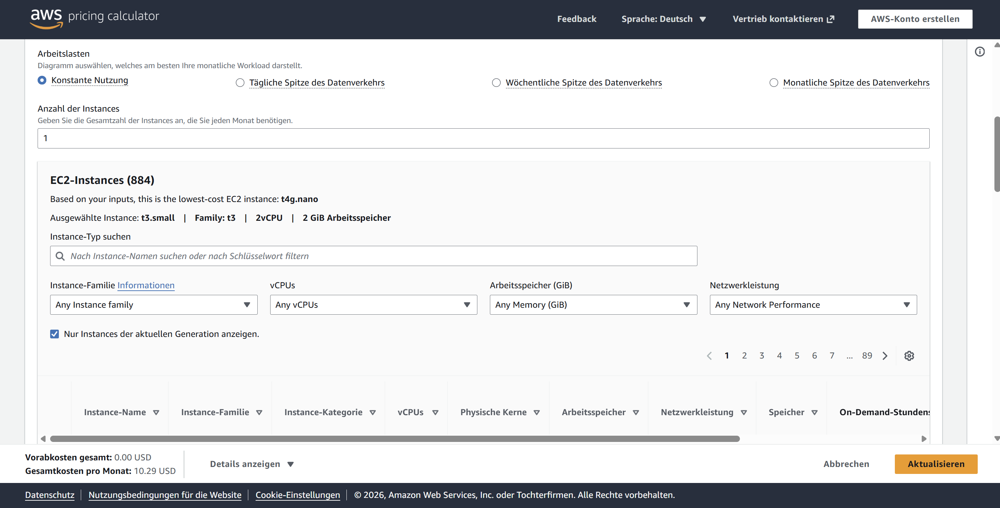

##### DB Server (EC2 t3.medium)
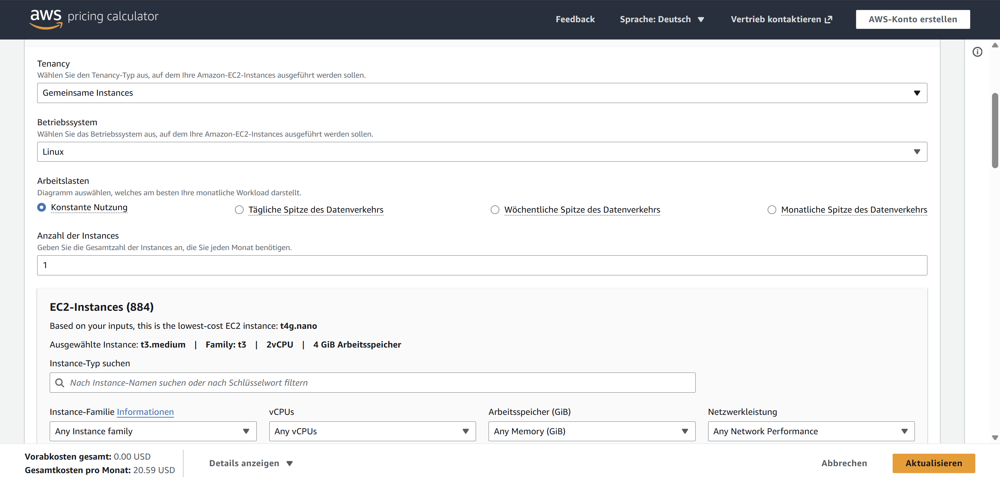

##### AWS Gesamtübersicht
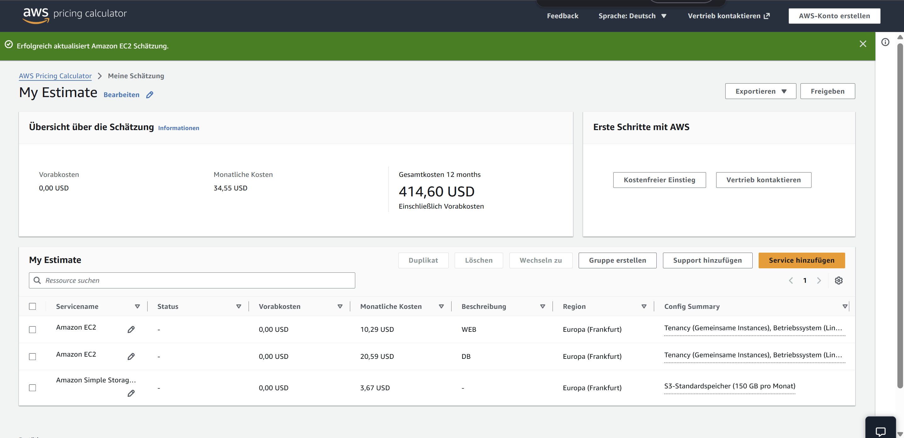

#### AWS Gesamtkosten
| Komponente | Monatliche Kosten |
|------------|-------------------|
| Web Server (EC2 t3.small) | $10.29 |
| DB Server (EC2 t3.medium) | $20.59 |
| Backup (S3 150 GB) | $3.67 |
| **TOTAL AWS** | **$34.55/Monat** |

---

### Azure Konfiguration

#### Web Server
| Parameter | Wert | Begründung |
|-----------|------|------------|
| Instance Type | B1ms | 1 vCPU, 2 GB RAM - entspricht genau der On-Premise Spezifikation |
| Storage | 32 GB Standard SSD | Minimale verfügbare Option über 20 GB Anforderung |
| Region | West Europe | EU-Region für Datenschutz, gute Konnektivität |
| OS | Linux (Ubuntu) | Wie bestehende On-Premise Umgebung |

#### DB Server
| Parameter | Wert | Begründung |
|-----------|------|------------|
| Instance Type | B2s | 2 vCPU, 4 GB RAM - passt perfekt zur Anforderung |
| Storage | 128 GB Standard SSD | Nächstgrössere Option über 100 GB, bietet Puffer |
| Region | West Europe | Gleiche Region wie Web Server für niedrige Latenz |
| OS | Linux (Ubuntu) | Konsistent mit bestehender Infrastruktur |

#### Backup Storage
| Parameter | Wert | Begründung |
|-----------|------|------------|
| Service | Blob Storage (Hot) | Optimiert für häufige Zugriffe auf Backup-Daten |
| Kapazität | 150 GB | Für alle definierten Backup-Zyklen |

#### Azure Screenshots

##### Web Server (B1ms)
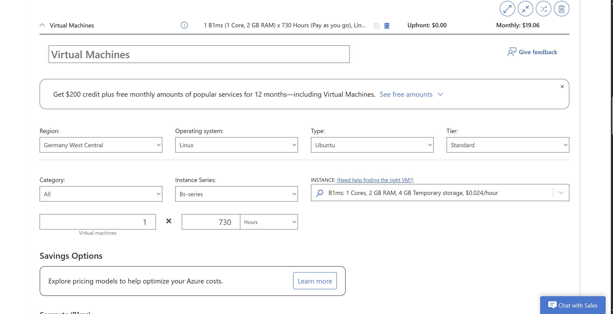

##### DB Server (B2s)
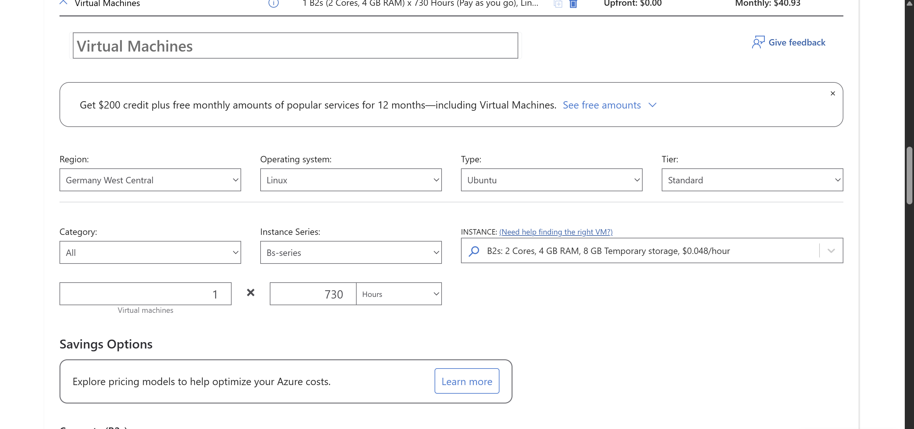

##### Backup Storage (Blob Storage)
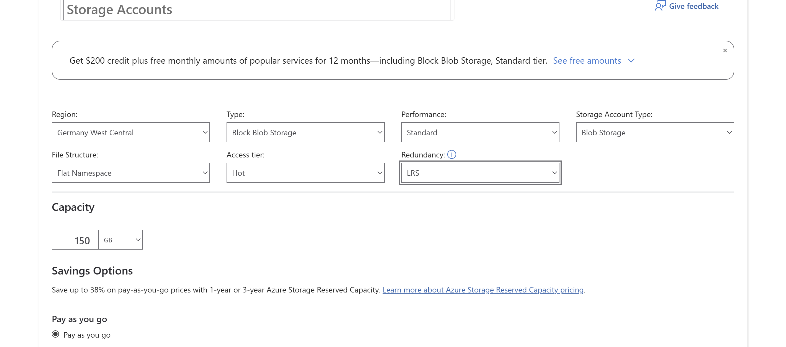

##### Azure Gesamtübersicht
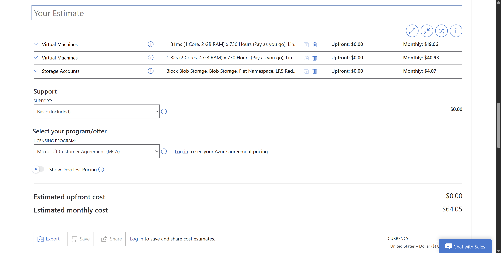

#### Azure Gesamtkosten
| Komponente | Monatliche Kosten |
|------------|-------------------|
| Web Server (B1ms + 32 GB) | $19.06 |
| DB Server (B2s + 128 GB) | $40.93 |
| Backup (Blob 150 GB) | $4.07 |
| **TOTAL Azure** | **$64.05/Monat** |

---

### Erklärung der Abweichungen (IAAS)

1. **Instance Types**: Cloud-Provider bieten standardisierte Konfigurationen. Eine exakte 1:1 Übertragung ist nicht möglich, daher muss die nächstpassende Option gewählt werden.

2. **Storage-Grössen**: Azure verwendet vordefinierte Disk-Grössen (32 GB, 128 GB), während AWS flexiblere, granulare Auswahl ermöglicht. Dies führt zu unterschiedlichen Kosten.

3. **Burstable Instances**: Beide Provider empfehlen Burstable-Instanzen (t3-Serie bei AWS, B-Serie bei Azure) für variable Workloads wie CRM-Anwendungen, die nicht konstant hohe CPU-Auslastung haben.

4. **Preisunterschied AWS vs Azure**: AWS ist kostengünstiger ($34.55 vs $64.05) aufgrund flexiblerer Storage-Optionen und günstigerer Instance-Typen für diese Workload-Grösse.

---

## B) PAAS - Replatforming: Heroku (20%)

### Dyno (Web Server)

#### Screenshot Heroku Dynos
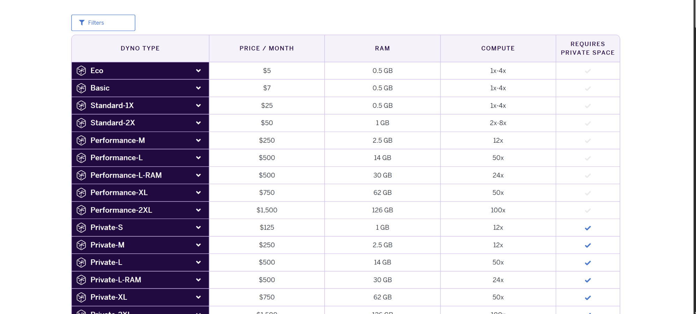

| Dyno Type | Preis/Monat | RAM | Begründung |
|-----------|-------------|-----|------------|
| **Standard-2X** | **$50** | 1 GB | Production-fähige Option, empfohlen für 30 Benutzer |

**Hinweis**: Heroku Dynos sind Container-basiert und haben andere Ressourcen-Charakteristika als traditionelle VMs. Standard-2X ist die minimale Production-Empfehlung für diese Anzahl Benutzer.

### Datenbank (Heroku Postgres)

#### Screenshot Heroku Postgres
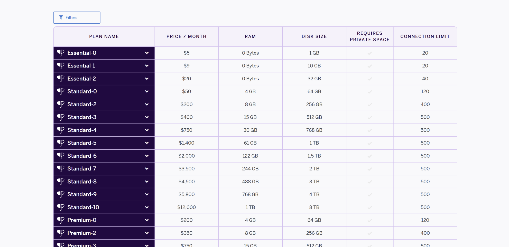

| Plan | Preis/Monat | RAM | Disk | Begründung |
|------|-------------|-----|------|------------|
| **Standard-0** | **$50** | 4 GB | 64 GB | 4 GB RAM entspricht Anforderung, 64 GB Storage für Startphase ausreichend |

**Alternative**: Standard-2 ($200/Monat) mit 256 GB Storage falls mehr Kapazität benötigt wird.

### Backup

| Parameter | Wert | Begründung |
|-----------|------|------------|
| Service | **Inkludiert** | Standard-Pläne beinhalten automatische Backups |
| Häufigkeit | Täglich | Automatisch durch Heroku verwaltet |
| Retention | 7 Tage | Standard-Retention bei Standard-Plänen |
| Kosten | **$0** | Im Postgres Standard-Plan enthalten |

**Wichtig**: Heroku Postgres Standard-Pläne beinhalten automatische Backups im Preis - anders als bei IAAS-Lösungen (AWS/Azure), wo Backup-Storage separat berechnet wird.

### Heroku Gesamtkosten
| Komponente | Monatliche Kosten |
|------------|-------------------|
| Web Dyno (Standard-2X) | $50 |
| Postgres (Standard-0) | $50 |
| Backup | $0 (inkludiert) |
| **TOTAL Heroku** | **$100/Monat** |

### Erklärung der Abweichungen (PAAS)

1. **Dyno-Architektur**: Heroku Dynos sind optimierte Container, keine vollständigen virtuellen Maschinen. Weniger direkter RAM-Zugriff, aber besser für Web-Anwendungen optimiert.

2. **Managed Database Service**: Heroku Postgres ist vollständig verwaltet - Betriebssystem-Updates, Sicherheits-Patches und Backups werden automatisch durch Heroku durchgeführt.

3. **Keine OS-Administration**: Die Ubuntu-Server-Administration entfällt vollständig, da Heroku die Infrastruktur-Ebene verwaltet.

4. **Backup inkludiert**: Im Gegensatz zu IAAS (AWS/Azure) sind bei Heroku Postgres Standard-Plänen automatische tägliche Backups bereits im Preis enthalten. Kein separater Backup-Storage erforderlich.

5. **Kosten vs. Aufwand**: PAAS ist teurer als IAAS ($100 vs. $35-64), reduziert aber den administrativen Aufwand erheblich und eliminiert die Notwendigkeit für Server-Management.

---

## C) SAAS - Repurchasing: Zoho & Salesforce (10%)

### Zoho CRM

#### Screenshot Zoho Pricing
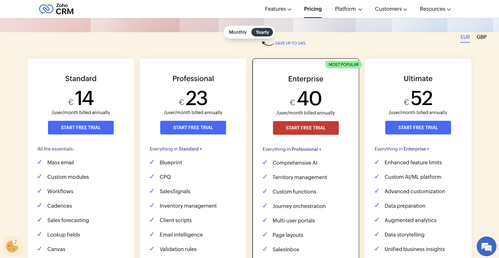

| Plan | Preis/User/Monat | Für 30 User | Features |
|------|------------------|-------------|----------|
| Standard | €14 | €420/Monat | Basis CRM-Funktionalität |
| **Professional** | **€23** | **€690/Monat** | Workflows, Blueprint, Inventory Management ✅ |
| Enterprise | €40 | €1,200/Monat | Erweiterte Features wie AI, Territory Management |

**Empfehlung: Professional (€23/User)**
- Umfasst Workflow-Automatisierung und Blueprint für Prozessmanagement
- Optimales Preis-Leistungs-Verhältnis für 30 Benutzer
- Inventory Management für erweiterte CRM-Funktionalität

---

### Salesforce Sales Cloud

#### Screenshot Salesforce Pricing
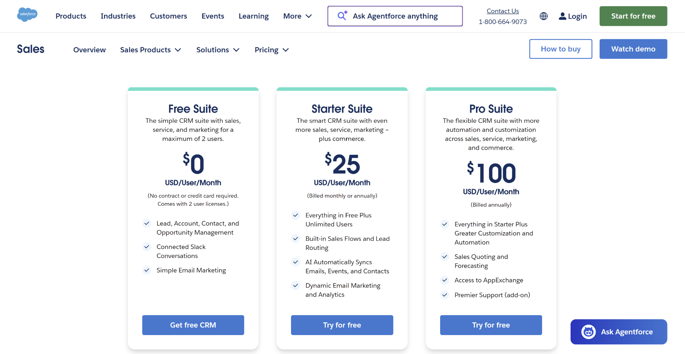

| Plan | Preis/User/Monat | Für 30 User | Features |
|------|------------------|-------------|----------|
| Free Suite | $0 | - | Maximal 2 Benutzer! |
| **Starter Suite** | **$25** | **$750/Monat** | Lead Management, Reports, Basis-Features ✅ |
| Pro Suite | $100 | $3,000/Monat | Erweiterte Automatisierung, Forecasting |

**Empfehlung: Starter Suite ($25/User)**
- Kostengünstigste Option für 30 Benutzer
- Enthält alle essentiellen CRM-Funktionen
- Pro Suite wäre für die Anforderungen überdimensioniert und zu teuer

---

### SAAS-Vergleich und Auswahl

| Anbieter | Plan | Kosten/Monat (30 User) | Empfehlung |
|----------|------|------------------------|------------|
| **Zoho CRM** | Professional | **€690 (~$750)** | ✅ **Empfohlene Lösung** |
| Salesforce | Starter Suite | $750 | Solide Alternative |

**Begründung für Zoho:**
1. Mehr Funktionalität im Professional-Plan verglichen mit Salesforce Starter Suite
2. Intuitivere Benutzeroberfläche für KMU
3. Niedrigere Einführungs- und Anpassungskosten
4. Geringere Komplexität für kleine bis mittlere Unternehmen

---

## D) Interpretation der Resultate (10%)

### Kostenvergleich aller Varianten

| Variante | Modell | Monatliche Kosten | Jährliche Kosten |
|----------|--------|-------------------|------------------|
| AWS | IAAS | $34.55 | $414.60 |
| Azure | IAAS | $64.05 | $768.60 |
| Heroku | PAAS | $100.00 | $1,200.00 |
| Zoho CRM | SAAS | ~$750.00 | ~$9,000.00 |
| Salesforce | SAAS | $750.00 | $9,000.00 |

### Versteckte Kosten (nicht in Kalkulatoren)

#### IAAS (AWS/Azure)
- **Personalaufwand**: IT-Administrator für Server-Management (grösster Kostenfaktor!)
- **Netzwerk-Traffic**: Egress-Kosten bei hohem Datenverkehr
- **Monitoring/Logging**: Zusätzliche Services wie CloudWatch, Azure Monitor
- **Load Balancer**: Falls Hochverfügbarkeit und Lastverteilung gewünscht

#### PAAS (Heroku)
- **Add-ons**: Zusätzliche Services für Logging, Monitoring, SSL-Zertifikate
- **Skalierung**: Zusätzliche Dynos bei Lastspitzen erhöhen Kosten
- **Entwickleraufwand**: Anpassung der bestehenden CRM-Software an Heroku-Plattform

#### SAAS (Zoho/Salesforce)
- **Schulungen**: Mitarbeiter müssen auf neue Software umgeschult werden
- **Datenmigration**: Export/Import aus bestehendem CRM-System
- **Customization**: Anpassungen an firmenspezifische Prozesse können zusätzlich kosten

### Warum sind die Kosten unterschiedlich?

| Faktor | IAAS | PAAS | SAAS |
|--------|------|------|------|
| Infrastruktur-Management | Kunde | Anbieter | Anbieter |
| OS-Wartung | Kunde | Anbieter | Anbieter |
| Anwendungs-Updates | Kunde | Kunde | Anbieter |
| Sicherheits-Patches | Kunde | Anbieter | Anbieter |
| Backup-Management | Kunde | Teilweise Anbieter | Anbieter |
| Support-Level | Basis | Erweitert | Umfassend |

**Grundprinzip: Je mehr Verantwortung der Anbieter übernimmt, desto höher die Kosten - aber desto geringer der interne Aufwand für die Firma.**

### Sind die Unterschiede gerechtfertigt?

**Ja, die Preisunterschiede sind gerechtfertigt**, weil:

1. **IAAS** ($35-64/Monat) erscheint günstig, erfordert aber IT-Personal für Server-Management (typischerweise $5,000-10,000/Monat Gehalt!)

2. **PAAS** ($100/Monat) reduziert den administrativen Aufwand erheblich, da Infrastruktur-Management entfällt

3. **SAAS** ($750/Monat) eliminiert alle technischen Aspekte komplett - die Firma kann sich auf ihr Kerngeschäft konzentrieren

**Fazit: Die scheinbar günstigste Option (AWS mit $34.55/Monat) wird deutlich teurer, wenn IT-Personalkosten berücksichtigt werden.**

---

### Aufwand für die Firma

#### IAAS (AWS/Azure) - Rehosting
| Aufgabe | Einmalig | Laufend/Monat |
|---------|----------|---------------|
| Server-Setup und Konfiguration | 4h | - |
| CRM-Installation und Konfiguration | 8h | - |
| Datenmigration | 8h | - |
| Netzwerk- und Sicherheitskonfiguration | 8h | - |
| Updates, Patches, Backup-Management | - | 4-8h |
| **Total** | **~30h** | **~6h/Monat** |

**Voraussetzung**: IT-Know-how für Linux-Administration, Netzwerk-Konfiguration, Datenbank-Management

#### PAAS (Heroku) - Replatforming
| Aufgabe | Einmalig | Laufend/Monat |
|---------|----------|---------------|
| CRM-Anwendung für Heroku-Plattform anpassen | 16h | - |
| Deployment-Pipeline einrichten | 4h | - |
| Datenbank-Migration | 4h | - |
| Code-Updates und Deployment | - | 2-4h |
| **Total** | **~25h** | **~3h/Monat** |

**Voraussetzung**: Entwickler-Know-how für Anwendungsanpassung und Deployment

#### SAAS (Zoho/Salesforce) - Repurchasing
| Aufgabe | Einmalig | Laufend/Monat |
|---------|----------|---------------|
| Account-Setup und Konfiguration | 2h | - |
| Datenmigration aus altem System | 8h | - |
| Customization und Anpassungen | 16h | - |
| Mitarbeiter-Schulungen | 16h | - |
| Administration und Wartung | - | 1-2h |
| **Total** | **~42h** | **~1.5h/Monat** |

**Voraussetzung**: Kein technisches IT-Know-how erforderlich, Business-Know-how ausreichend

---

### Empfehlung für den CEO

| Szenario | Empfehlung | Begründung |
|----------|------------|------------|
| Firma verfügt über IT-Team | **AWS** | Kostengünstigste Option mit vollständiger Kontrolle |
| Firma verfügt über Entwickler | **Heroku** | Guter Kompromiss zwischen Kosten und Aufwand |
| Firma möchte keine IT-Arbeit | **Zoho CRM** | Vollständig verwaltete Lösung, alles inkludiert |

**Für eine Firma ohne technisches Know-how empfehle ich Zoho CRM Professional:**
- Keine IT-Administration erforderlich
- Moderne, sichere und ständig aktualisierte CRM-Lösung
- Die höheren monatlichen Kosten ($750 vs. $35) werden durch eingesparte IT-Personalkosten mehr als kompensiert
- Firma kann sich auf ihr Kerngeschäft konzentrieren statt auf IT-Infrastruktur

---

## Dateien

```
KN10/
├── README.md
└── Bilder/
    ├── aws-webconfig.png
    ├── aws-dbconfig.png
    ├── aws-total.png
    ├── azure-webconfig.png
    ├── azure-dbconfig.png
    ├── azure-backupstorage.png
    ├── azure-total.png
    ├── herokudynos.png
    ├── herokupostgres.png
    ├── zohocrm.png
    └── salesforce.png
```

